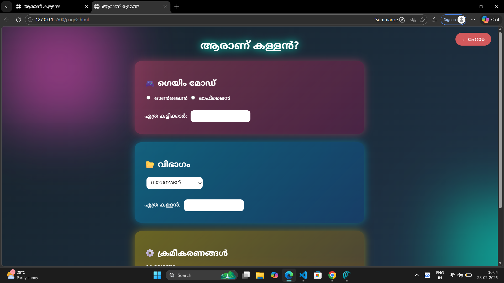
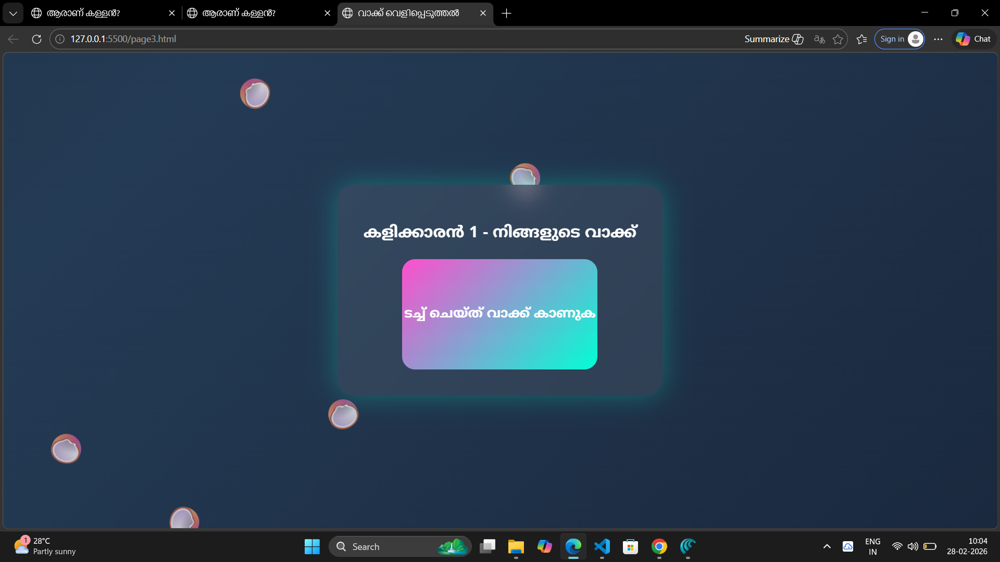
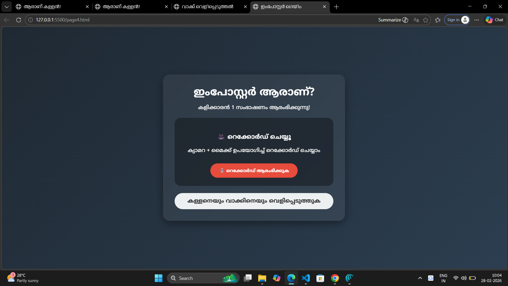

<p align="center">
  
</p>

# Aranu Kallan? 🎯

## We created a fun concept called “Imposter for Malayali”, which is basically a humorous take on the popular idea of an imposter, but tailored for Malayali culture. It involves using funny Malayalam words, nicknames, or phrases to identify someone who’s pretending, acting suspicious, or just being extra dramatic in everyday life. The idea is to mix relatable local humor with the imposter theme, making it entertaining for friends, social media, or casual memes, while keeping it light-hearted and culturally specific.

### Team Name: D&D

### Team Members
- Member 1: Anaha.S - College of engineering perumon
- Member 2: Adithya Anil - College of engineering perumon

### Hosted Project Link
https://anaha-2006.github.io/Aranu-Kallan-/

### Project Description
This “Who is the Imposter” game for Malayalis works entirely in Malayalam, making it easy for players to understand and play. Players are given words from familiar categories like Malayalam actors, local foods, and places, and one player is secretly assigned as the imposter. By keeping the game in the local language and culturally relevant, it solves the problem of Malayalis struggling with English-based versions and allows everyone to fully enjoy the game.

### The Problem statement
Most existing “Who is the Imposter” games are in English, making it difficult for Malayali players, especially teens and kids, to understand and enjoy. There is currently no dedicated version of the game in Malayalam that is fully accessible and engaging for local players. This creates a need for a Malayalam-language version of the game that is fun, easy to use, and culturally relevant.

### The Solution
We created a “Who is the Imposter” game app entirely in Malayalam, making it easy for local players to understand and enjoy. The app includes familiar Malayalam elements such as the names of popular actors, local food items, and other culturally relevant categories. This ensures that Malayali players can fully participate, have fun, and connect with the game in their own language.

---

## Technical Details

### Technologies/Components Used

**For Software:**
- Languages used: html,css,js
- Frameworks used: nil
- Libraries used: nil
- Tools used:  VS Code, Git

**For Hardware:**
- Main components: [List main components]
- Specifications: [Technical specifications]
- Tools required: [List tools needed]

---

## Features

List the key features of your project:
- Feature 1: Malayalam Content – All game elements like player names, words, categories, and instructions are in Malayalam, making it easy for local users to understand and play.
- Feature 2: Dynamic Player & Word Assignment – Randomly assigns roles like “Imposter” and provides each player a word from selected Malayalam categories (actors, food, places, etc.).
- Feature 3: Interactive UI & Animations – Features smoke effects, floating fireflies, card flips, and animated buttons to make the gameplay visually engaging.
- Feature 4: Client-Side Functionality – Fully browser-based using HTML, CSS, and JavaScript with localStorage to save game state, requiring no installation or backend setup

---

## Implementation

### For Software:

#### Installation
```bash
[Installation commands - nil]
```

#### Run
```bash
[Run commands - index.html]
```

### For Hardware:

#### Components Required
[List all components needed with specifications]

#### Circuit Setup
[Explain how to set up the circuit]

---

## Project Documentation

### For Software:

#### Screenshots (Add at least 3)


The second page is the game setup page where players choose the game mode, number of players, category, and other settings. It dynamically generates input fields for player names based on the number entered. When the “Start Game” button is clicked, it randomly selects a word from the chosen category and stores it in localStorage for the next page. The page also has animated background blobs for a visually engaging interface.


The third page is the word reveal page for each player. It shows the current player's name and a card that hides their assigned word. When the player clicks the card, it flips to reveal the word, and a “Next Player” button appears to move to the next player. This continues until all players have seen their words, making it easy to play the game turn by turn.


The fourth page is the result or summary page. It displays the imposter’s name and the selected word for the game, showing the final outcome to all players. It also includes a “New Game” button that clears the previous game data and allows players to start a fresh game. Floating emojis add a fun and playful visual effect to the page.

#### Diagrams

**System Architecture:**


*Explain your system architecture - components, data flow, tech stack interaction*

**Application Workflow:**


*Add caption explaining your workflow*

---


 
  

---


## Project Demo

### Video
[Click here to see the Demo Video](https://drive.google.com/file/d/1BuRdonb90s6ASbKCnZ23ntWEA0fka1Gu/view?usp=sharing)

*Explain what the video demonstrates - key features, user flow, technical highlights*


---

## AI Tools Used (Optional - For Transparency Bonus)

If you used AI tools during development, document them here for transparency:

**Tool Used:** [ GitHub Copilot, ChatGPT, Claude]

**Purpose:** [What you used it for]
- building frontend
- Debugging assistance 
- Code review and optimization suggestions

**Key Prompts Used:**
- 
- "Debug this async function that's causing race conditions"
- "Optimize this database query for better performance"

**Percentage of AI-generated code:** [60%]

**Human Contributions:**
- Integration and testing
- UI/UX design decisions

*Note: Proper documentation of AI usage demonstrates transparency and earns bonus points in evaluation!*

---

## Team Contributions

- [Anaha.S]: [frontend modificator,adder]
- [Adithya Anil]: [Frontend code giver]


---

## License

This project is licensed under the [LICENSE_NAME] License - see the [LICENSE](LICENSE) file for details.

**Common License Options:**
- MIT License (Permissive, widely used)
- Apache 2.0 (Permissive with patent grant)
- GPL v3 (Copyleft, requires derivative works to be open source)

---

Made with ❤️ at TinkerHub
